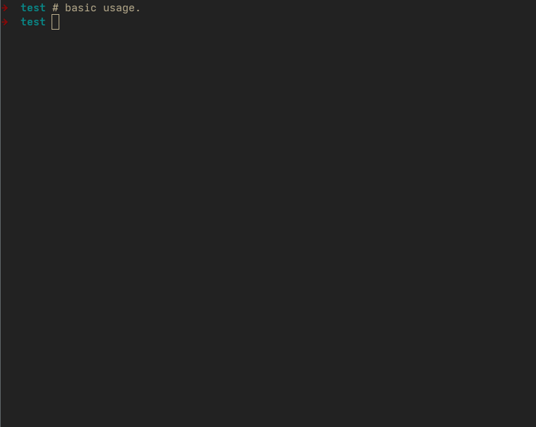
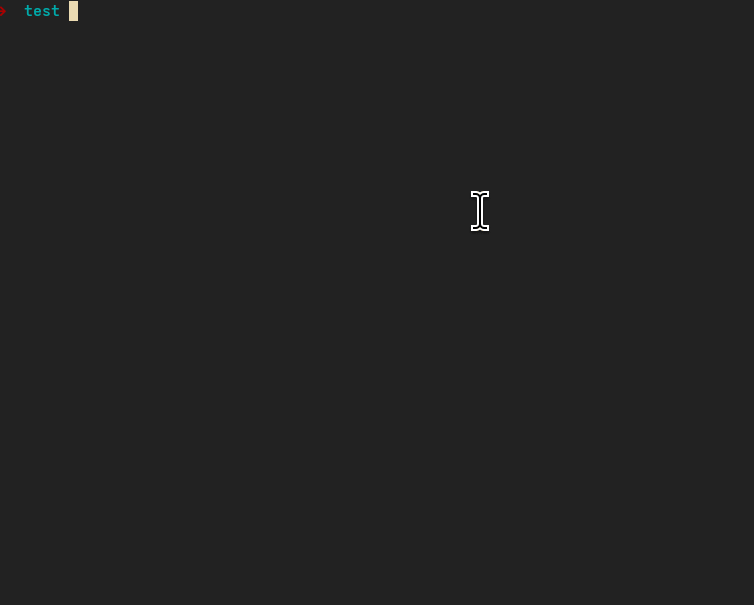
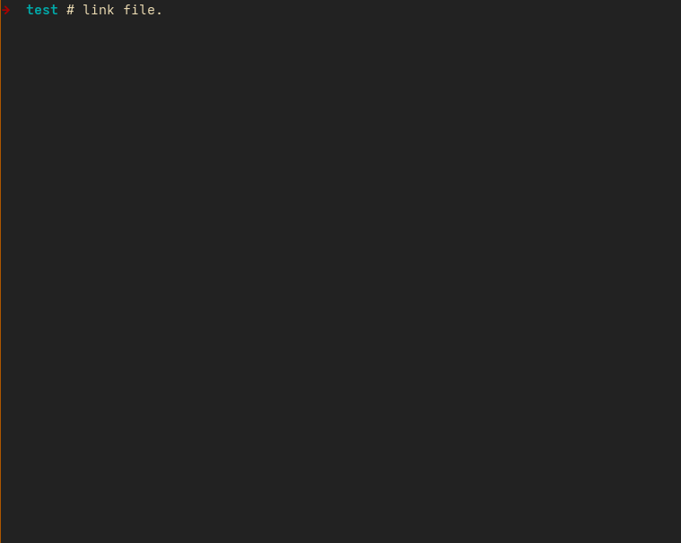

这里是 Alluviall 项目。感谢关注。任何 BUG 都可以提交 Issue。

未来会考虑代码开源。当然，你也可以使用 AI 自己手搓一个。但是作者并没有使用 AI 生成（所以一定会有很多 BUG）

---

### Alluvial Shell 基本功能

Beta 26.8.14 主要功能：

**01 传统资源管理器功能**

1. 新建文件
2. 创建文件夹（通过文件提升实现）
3. 文件夹索引和导航
4. 删除文件
5. _文件移动_
6. 打开文件

**02 Alluvial 独有功能**

1. 标签
2. 来源和去向

#### 02.1 产品功能演示

**01 打开**

1. CMD/Shell 方式
2. GUI 方式

**02 新建文件**

1. 使用电脑自带的工具创建或者新建文件
2. 在编辑栏中输入文件名

**03 标签和操作页**

标签说明

1. 自指标签（真实内容）
2. 来源标签（其他内容）
3. 文件夹标签（非内容）

如果标签对应的内容存在，则高亮。若不存在则会显示左右框：`[xxx]`

操作说明：

**Navigation（基本导航）**

基本导航，使用 空格、回车、退格，实现子宇宙（子文件夹）进入、内容选择和返回上级宇宙（上级目录）

**03.1 Touch（新建文件）**

如果某个标签对应的内容不存在，按下回车之后，会创建一个对应标签的空白内容。

**03.2 Link（引用文件）**

用户可以引用路径下的任何一个文件。这个操作等同于给文件打标签。

**03.3 Open（详细内容）**

用户可以使用特定的软件打开标签对应的内容。

**03.4 Lift（标签提升）**

如果标签对应的内容是一个文件。可以通过 Lift 操作让标签成为一个文件夹。

**03.5 Delete（删除文件）**

删除文件，可以使用键盘的 Delete

---

Alluvial 是一个以个体驱动，面向社会的认知辅助与效率协作工具族。

现在，你可以将 Alluvial Beta 理解为一个「资源管理器」，通过「关系」、「来源」和「去向」补足了传统文件系统中所缺乏的数据结构。帮助我们在当下更好的把握自身的数据。
